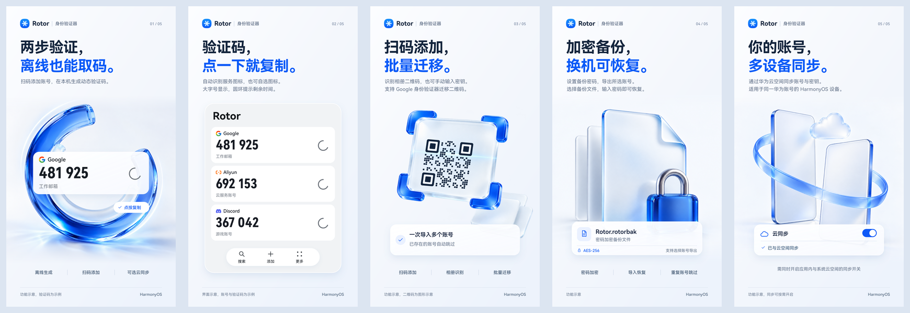

# Rotor 身份验证器：HarmonyOS 上架素材

Rotor 身份验证器是一款面向 HarmonyOS NEXT 的两步验证工具，支持离线生成验证码、扫码添加、批量迁移、加密备份与可选云同步。本文档提供上架文案与宣传图素材。

## 应用名称

**Rotor 身份验证器**（英文：Rotor Authenticator）。

桌面与商店展示「Rotor 身份验证器」，应用内首页与关于页展示品牌名 Rotor。

## 一句话简介

**离线验证码，扫码添加与云同步**

共 14 个字符，含标点。

## 应用介绍

以下内容可粘贴到 AppGallery Connect：

```text
Rotor 身份验证器是面向 HarmonyOS 的两步验证工具。为支持验证器的网站和 App 添加账号后，即可在本机离线生成动态验证码，登录时点按复制使用。

- 离线取码：验证码在本机生成，无需联网。大字号显示，圆环提示剩余时间，临近过期时变色提醒。
- 添加账号：扫描服务提供的二维码、识别相册中的二维码图片，或手动输入设置密钥。
- 批量迁移：识别 Google 身份验证器导出的迁移二维码，一次导入其中的多个账号，重复账号自动跳过。
- 加密备份：选择账号并设置密码，导出 AES-256 加密的备份文件。换机后选择备份文件、输入密码即可恢复，重复账号自动跳过。
- 可选云同步：通过华为云空间，在登录同一华为账号的 HarmonyOS 设备间同步账号与密钥。需同时开启应用内与系统云空间中的 Rotor 同步开关。
- 账号整理：支持按名称和描述搜索、长按拖动排序、左滑编辑与删除，以及批量删除和导出。
- 系统适配：采用 HarmonyOS 原生界面，深浅色模式跟随系统。

支持 TOTP（基于时间）与 HOTP（基于计数器）两种动态口令，适用于支持这两种标准的两步验证服务（2FA）。可设置 15、30、60 秒周期，6 位或 8 位验证码，以及 SHA1、SHA256、SHA512 算法，具体参数应与所使用的服务一致。
```

## 宣传图

素材位于 [assets/store-v2](assets/store-v2/)，按下表顺序展示。

| 顺序 | 主题 | 主标题 | PNG 成图 | SVG 源文件 |
| --- | --- | --- | --- | --- |
| 1 | 离线取码 | 两步验证，离线也能取码。 | [01-hero.png](assets/store-v2/01-hero.png) | [01-hero.svg](assets/store-v2/01-hero.svg) |
| 2 | 验证码列表 | 验证码，点一下就复制。 | [02-codes.png](assets/store-v2/02-codes.png) | [02-codes.svg](assets/store-v2/02-codes.svg) |
| 3 | 扫码与迁移 | 扫码添加，批量迁移。 | [03-scan.png](assets/store-v2/03-scan.png) | [03-scan.svg](assets/store-v2/03-scan.svg) |
| 4 | 加密备份 | 加密备份，换机可恢复。 | [04-backup.png](assets/store-v2/04-backup.png) | [04-backup.svg](assets/store-v2/04-backup.svg) |
| 5 | 可选云同步 | 你的账号，多设备同步。 | [05-sync.png](assets/store-v2/05-sync.png) | [05-sync.svg](assets/store-v2/05-sync.svg) |



### 素材规格

- 尺寸：`1080 x 1920 px`，比例为 `9:16`。
- 成图：5 张 PNG，单张小于 `1 MiB`。
- 源文件：5 张自包含 SVG，插画与品牌图标内嵌，无需加载外部图片。
- 可编辑内容：标题、说明、验证码、卡片、按钮、倒计时环与二维码示意均为独立矢量元素。
- 立体插画：使用内置 `image_gen` 生成，作为位图内嵌于 SVG；原图保存在 [artwork](assets/store-v2/artwork/)。
- 字体：正文与标题使用 `HarmonyOS Sans SC`，验证码使用 `HarmonyOS Sans Condensed`；SVG 保留文本节点，编辑环境需安装对应字体。
- 配色：品牌蓝 `#0A59F7`、浅蓝白背景、深蓝标题；应用界面示意使用浅灰背景与白色卡片。
- 展示内容：界面示意按当前组件结构绘制，底部包含「搜索、添加、更多」悬浮栏。账号、验证码与二维码均为示例，素材属于功能宣传图。

### 编辑与导出

修改 [build.mjs](assets/store-v2/build.mjs) 中的文案或排版后，在项目根目录执行：

```bash
node assets/store-v2/build.mjs
```

脚本使用 `rsvg-convert` 导出 PNG，使用 ImageMagick 生成总览图；运行环境需有 Node.js、librsvg、ImageMagick 与上述字体。输入为 `artwork/` 中的插画和应用内品牌图标，输出为同目录的 5 组 SVG、PNG 及 `overview.png`。

直接编辑 SVG 后，可单独导出对应 PNG：

```bash
rsvg-convert -w 1080 -h 1920 assets/store-v2/01-hero.svg -o assets/store-v2/01-hero.png
```

生成脚本以脚本中的文案和排版为准。全部插画的提示词见 [PROMPTS.md](assets/store-v2/PROMPTS.md)。

## 权限与数据说明

### 系统权限

应用声明 3 项系统权限，均为系统授予类型。

| 权限 | 用途 |
| --- | --- |
| `ohos.permission.GET_NETWORK_INFO` | 开启云同步后监听网络状态，显示同步连接状态，网络恢复后触发同步。 |
| `ohos.permission.INTERNET` | 按用户填写的链接下载自定义服务图标，下载后缓存在本机。 |
| `ohos.permission.VIBRATE` | 长按拖动账号卡片时播放触感反馈。 |

扫码使用 Scan Kit 默认界面，备份导入导出使用系统文件选择器，从图库选择图标使用系统图库选择器。应用未声明 `CAMERA`、`READ_MEDIA`、`WRITE_MEDIA` 权限。

### 存储与同步

- 本机存储：账号名称、描述、密钥和算法参数位于应用沙箱内的关系型数据库 `rotor.db`，安全等级为 `S3`。
- 云同步：开启后经华为云空间同步，`secret`、`name`、`note` 为云侧加密字段。关闭同步后，本机数据保留，已同步的云端数据可在系统云空间中管理或删除。
- 自定义图标：按链接下载或从图库选择的图标缩小后保存在应用沙箱的 `files/issuer_icons` 目录。开启云同步后，账号的图标选择随账号同步；链接图标在其他设备上重新下载，图库图标只保存在本机。
- 文件备份：`.rotorbak` 文件采用密码加密，保存到用户通过系统文件选择器指定的位置。
- 系统备份：`EntryBackupAbility` 为非导出的备份扩展，`allowToBackupRestore` 为 `true`，应用数据可随系统备份恢复或换机通道迁移。

## 开源许可

- 本项目以 GPL-3.0 许可开源，全文见 `LICENSE`。
- 服务图标与匹配规则来自 [2FAS Auth](https://github.com/twofas/2fas-android)（GPL-3.0）。百度智能云、火山引擎、七牛云图标来自 [thesvg](https://github.com/glincker/thesvg)（MIT），Gitee、1Panel 图标来自 thesvg（CC0）。各品牌标志归其所有者。
- 图标资源与匹配数据由 `scripts/gen_issuer_icons.py` 生成，更新时运行 `uv run scripts/gen_issuer_icons.py`。
