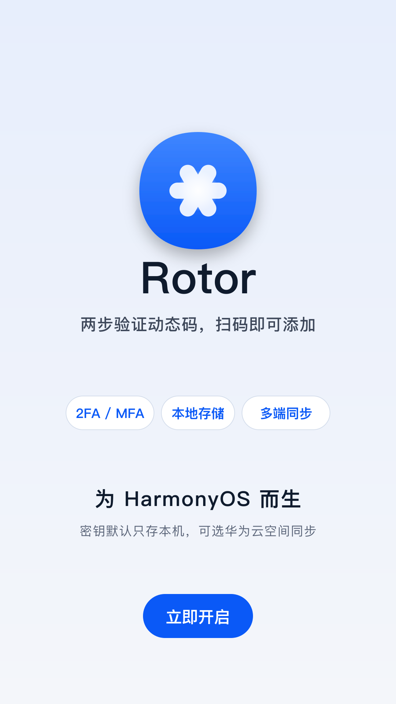
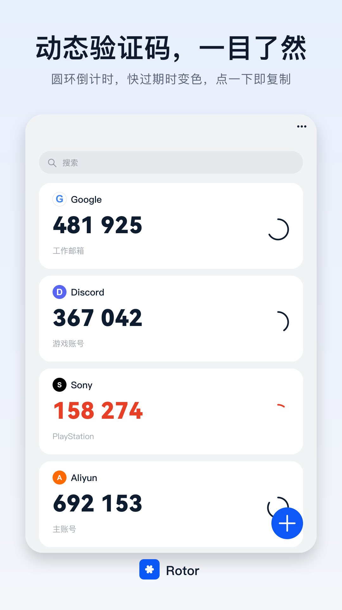
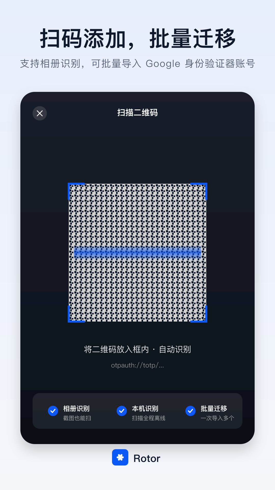
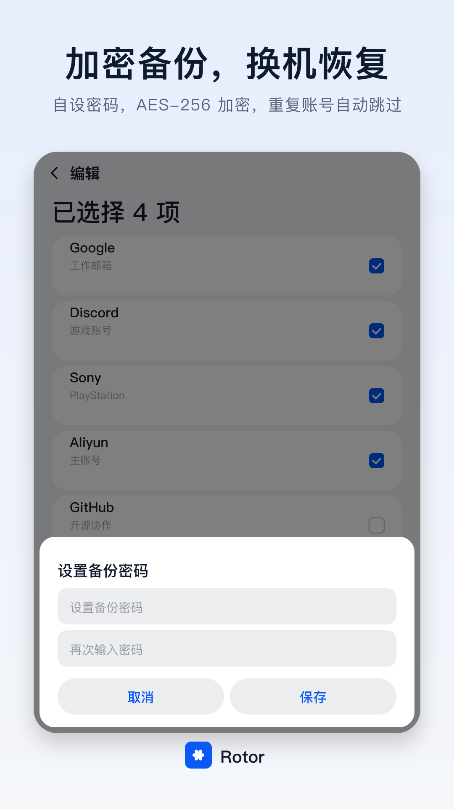
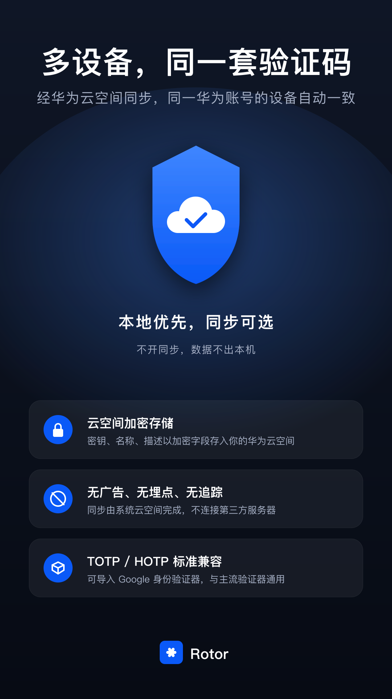

# Rotor 身份验证器：HarmonyOS 上架素材

> 本仓库为 Rotor 身份验证器——一款本地优先的 HarmonyOS NEXT 两步验证（2FA）动态验证码 App。本文档汇总应用商店上架所需的文案与宣传图素材。

---

## 应用名称

**Rotor 身份验证器**（英文：Rotor Authenticator）

商店名称、安装后的桌面名称、软著登记的软件名称（或简称）三者须一字不差，一个自然年内最多修改 2 次。应用内首页标题与关于页显示品牌名 Rotor。

---

## 一句话简介（中文 17 字以内）

**两步验证动态码，扫码添加，多端同步**

备选：

- 二次验证、两步验证动态码生成器
- 两步验证动态口令，支持批量迁移

---

## 应用介绍（8000 字以内）

以下为纯文本，整段粘贴到 AppGallery Connect：

```text
Rotor 身份验证器（Rotor Authenticator）是为 HarmonyOS 打造的两步验证工具。网站或 App 开启两步验证（也叫二次验证、双重验证、2FA、MFA）后，Rotor 为账号生成每 30 秒刷新一次的 6 位动态验证码（动态口令），登录时输入即可。遵循 TOTP（RFC 6238）与 HOTP（RFC 4226）标准，适用于 GitHub、阿里云、腾讯云等支持验证器 App 的服务。

- 扫码添加：扫描网站给出的二维码即可添加账号，也可识别相册中的二维码图片，或手动输入设置密钥。
- 批量迁移：扫描 Google 身份验证器导出的迁移二维码，一次导入多个账号。
- 验证码一目了然：大字号显示，圆环倒计时，快过期时变色提醒，点一下即复制。
- 多设备同步：开启云同步后，经华为云空间在登录同一华为账号的设备间自动同步，密钥、名称、描述以加密字段存储；不开启时数据只存本机。
- 加密备份：自设密码，以 AES-256 加密导出备份文件，换机后导入即可恢复，重复账号自动跳过。
- 高级选项：支持基于时间（TOTP）与基于计数器（HOTP）两种类型，周期 15、30、60 秒，6 位或 8 位，SHA1、SHA256、SHA512 算法。
- 整理方便：支持搜索、长按拖动排序、左滑编辑与删除，以及批量删除与导出。
- 深浅色模式跟随系统。
- 不申请任何敏感权限，无广告、无埋点；验证码在本机离线生成，不需要联网。
```

---

## 权限说明

Rotor 严格遵循「最小权限原则」，全应用申请 **2 项** 系统权限，均由系统自动授予、不弹窗，另声明 **1 项** 不向用户申请授权的系统备份扩展能力。

**申请的系统权限**

| 权限名 | 权限类型 | 申请时机 | 用途 |
| --- | --- | --- | --- |
| `ohos.permission.GET_NETWORK_INFO`（获取网络信息） | 普通权限 · 系统授予（`system_grant`） | 安装时由系统自动授予，不弹窗 | 开启云同步后监听默认网络的连接状态，在云同步页显示与云的连接状态，网络恢复时自动补同步；应用不直接访问网络 |
| `ohos.permission.VIBRATE`（振动） | 普通权限 · 系统授予（`system_grant`） | 安装时由系统自动授予，不弹窗 | 长按卡片拖拽排序时，调用系统 Sensor Service Kit 播放一次与系统组件一致的长按触感振动 |

**系统备份扩展能力（ExtensionAbility · 不向用户申请权限）**

| 能力名 | 类型 | 导出 | 用途 |
| --- | --- | --- | --- |
| `EntryBackupAbility` | `BackupExtensionAbility`（`@kit.CoreFileKit`） | `exported: false`，仅系统可调用 | 参与 HarmonyOS 系统级"换机克隆 / 整机备份恢复"流程；由 `backup_config.json` 控制（当前 `allowToBackupRestore: true`）。账号与密钥（应用沙箱内 SQLite）随系统通道迁移 |

**未申请的能力（明确不需要）**

- 相机（`CAMERA`）：扫码使用 Scan Kit 默认界面扫码，相机由系统预授权，应用不申请
- 网络访问（`INTERNET`）：应用自身不联网；开启云同步后由系统云空间服务在登录同一华为账号的设备间同步，不连接任何第三方服务器
- 存储（`READ_MEDIA` / `WRITE_MEDIA`）：备份导入导出走系统文件选择器（CoreFileKit Picker），无需常驻存储权限
- 位置、麦克风、通讯录、日历、通知等所有其他敏感权限均不申请

**数据存储边界**

- 账号与密钥（名称、备注、算法参数、base32 密钥）→ 应用内 **关系型数据库（ArkData / SQLite，安全等级 S3）**，位于应用沙箱，其他应用不可读
- 开启云同步后 → 用户本人的 **华为云空间**（端云同步容器 `rotor`），`secret`、`name`、`note` 为云侧加密字段；用户可在系统「设置 - 云空间」中管理或删除
- 加密备份文件（`.rotorbak`）→ 由用户在系统文件选择器中选定的位置，由用户自行管理

---

## 宣传图

| #   | 主题       | 文案                       | 截图                                          |
| --- | ---------- | -------------------------- | --------------------------------------------- |
| 1   | 品牌欢迎   | 两步验证动态码，扫码即可添加 | [01_hero.png](assets/01_hero.png)             |
| 2   | 列表与倒计时 | 动态验证码，一目了然        | [02_list.png](assets/02_list.png)             |
| 3   | 扫码与迁移 | 扫码添加，批量迁移          | [03_scan.png](assets/03_scan.png)             |
| 4   | 加密备份   | 加密备份，换机恢复          | [04_backup.png](assets/04_backup.png)         |
| 5   | 多设备同步 | 多设备，同一套验证码        | [05_privacy.png](assets/05_privacy.png)       |

### 预览







---

## 素材规格

- **尺寸**：1080 × 1920 px（9:16，按上架要求 3x 物理像素直接交付）
- **格式**：PNG（8-bit RGB / RGBA，非交错）
- **大小**：5 张图均 < 300 KB，符合 PNG/JPG/JPEG ≤ 5 MB 限制
- **字体**：PingFang SC / Hiragino Sans GB / Heiti SC（系统兜底）
- **配色**：与应用同色板（accent #0A59F7、bg #F1F3F5、text #0F1B2D）

## 文件清单

```
assets/
├── 01_hero.svg     01_hero.png      品牌欢迎页
├── 02_list.svg     02_list.png      首页 OTP 列表 + 圆环倒计时
├── 03_scan.svg     03_scan.png      扫码导入界面
├── 04_backup.svg   04_backup.png    AES 加密备份
└── 05_privacy.svg  05_privacy.png   多设备同步（深色品牌）
```

## 重新生成

每张 PNG 由对应同名 SVG 通过 `rsvg-convert` 渲染。修改文案或样式后，在 `assets/` 目录下执行：

```bash
for f in assets/*.svg; do
  rsvg-convert -w 1080 -h 1920 "$f" -o "${f%.svg}.png"
done
```

如需 JPEG / WEBP 版本（WEBP 单文件需 < 200 KB）：

```bash
# JPEG（高质量）
magick assets/01_hero.png -quality 92 assets/01_hero.jpg
# WEBP（压缩到 200 KB 以内）
magick assets/01_hero.png -define webp:target-size=200000 assets/01_hero.webp
```
